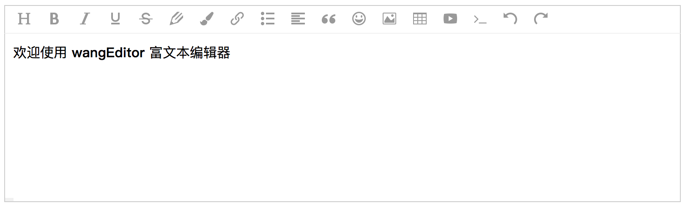

# wangEditor v4 增加视频上传功能

## 测试链接
- 视频链接 [https://blz-videos.nosdn.127.net/1/OverWatch/AnimatedShots/Overwatch_AnimatedShot_Soldier76_Hero.mp4](https://blz-videos.nosdn.127.net/1/OverWatch/AnimatedShots/Overwatch_AnimatedShot_Soldier76_Hero.mp4)


## video配置
``` jsx
editor.config.uploadImgShowBase64 = true // base 64 存储图片

editor.config.uploadVideoShowBase64 = false // base 64 存储视频
editor.config.uploadVideoServer = '/api/upload-video'// 配置服务器端地址
editor.config.uploadVideoHeaders = { }// 自定义 header
editor.config.uploadVideoName = 'file' // 后端接受上传文件的参数名
editor.config.uploadVideoMaxSize = 50 * 1024 * 1024 // 将附件大小限制为 50M
editor.config.uploadVideoMaxLength = 1 // 只有1个
editor.config.uploadVideoTimeout = 3 * 60 * 1000 // 设置超时时间
editor.config.zIndex = 999 //层级

this.editor.config.uploadVideoHooks = {
    fail: (xhr, editor, result) => {
        // 插入视频失败回调
    },
    success: (xhr, editor, result) => {
        // 视频上传成功回调
    },
    timeout: (xhr, editor) => {
        // 网络超时的回调
    },
    error: (xhr, editor) => {
        // 视频上传错误的回调
    },
    customInsert: (insertVideo, result, editor) => {
        // 视频上传成功，插入视频的回调
        //result为上传视频成功的时候返回的数据，这里我打印了一下发现后台返回的是data：[{url:"路径的形式"},...]
        console.log(result.data)
        //insertVideo()为插入视频的函数
        insertVideo(result.data.src)
    }
}

editor.config.showFullScreen = true
editor.create()
```


轻量级 web 富文本编辑器，配置方便，使用简单。

- 官网 [www.wangEditor.com](http://www.wangeditor.com/)
- 文档 [www.wangEditor.com/doc](http://www.wangeditor.com/doc/)



## 浏览器兼容性

兼容常见的 PC 浏览器：Chrome，Firefox，Safar，Edge，QQ 浏览器，IE11 。

不支持移动端。

## 基本使用

### NPM
```bash
npm i wangeditor --save
```
安装后几行代码即可创建一个编辑器：

```js
import E from "wangeditor";
const editor = new E("#div1");
editor.create();
```

更多使用方法，可参考[文档](http://www.wangeditor.com/doc/)。

## 开发文档

[开发文档](./docs/README.md)，供申请加入开发团队，或者对源码感兴趣的用户阅读。

加入开发团队后，还会有更详细的开发流程、规划、沟通机制。内容太多，这里不公开。

